# Introduction

Substance 3D Painter synchronization UE plugin 

## Function Introduction
●Seamless Integration:
Through the plug-in, assets in Substance Painter can be synchronized to Unreal Engine with one click, reducing manual operations and intermediate steps.

●Real-time Viewport Synchronization:
Real-time synchronization between Substance Painter and Unreal Engine viewports is achieved, and artists can directly view the effects in the engine, improving work efficiency.

●Automation and Flexibility:
Supports automatic creation of materials and synchronization of maps, and provides flexible output path settings and material configuration options to meet the needs of different projects.

## Video Demonstration
 

## Features
- Output textures according to presets
- Save corresponding paths in the engine
- Automatically output models
- Automatically create materials
- Automatically assemble models
- One-click synchronization of textures
- Synchronize viewports
- UDIM support

## Installation
- UE menu 
  Edit>Editor Preferences>Use Less CPU when in Background > Uncheck
  Edit>Project Settings>Python Remote Execution>Enable Remote Execution > Check
  
  UDIM support
  Edit>Project Settings>Engine>Rendering>Enable virtual texture support Check
  Edit>Project Settings>Engine>Rendering>Enable virtual texture for Opacity Mask Check

- Copy it to this "C:\Users\username\Documents\Adobe\Adobe Substance 3D Painter\python\plugins" directory

#### Version requirements 
  Substanc 3d Painter 10.1 
  Unreal 5.4 (theoretically 5.x and above are all supported but not tested) 

#### UE settings 
a. Turn off the Use Less CPU when in Background option in Editor Preferences to prevent UE from freezing when synchronizing the viewport. 

 

b. Turn on Enable Remote Execution in Project Settings to support remote execution of Python scripts. 

 

c. If UDIM support is required, you need to turn on Enable virtual texture support and Enable virtual textures for Opacity Mask under Project Settings->Rendering to support virtual textures. 

 

### SP settings 
a. Python>Plugins Folder to open the python plugin directory. 

 

b. Unzip to the Plugins directory and restart SP. 

 

c. Make sure SPsync is enabled. 

 
 

d. Plugin window 

 

#### How to use
a. You need to open the project and wait for the relevant assets to be loaded. Otherwise, the UI is frozen. 
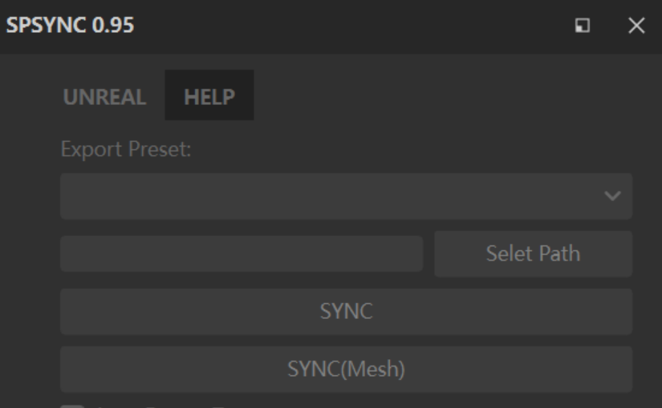 
b. In addition to the built-in or created output presets, the first preset is the preset that adapts to the automatically assembled material.
If you select other presets, the material and mounting model will not be automatically created.
By default, one material corresponds to four map channels. 
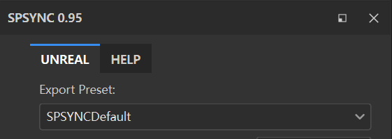 
| Suffix | R | G | B | A |
| :--: | :--: | :--: | :--: | :--: |
| _BCO | Alobedo.R | Alobedo.G | Alobedo.B | Opacity |
| _MRAS | Metallic | Roughness | AO | Translucency |
| _N | Normal.R | Normal.G | Normal.B | Null |
| _ES | Emissive.R | Emissive.G | Emissive.B | Null |

The output map is named:
T + _model name + _material name + _suffix name

c. Click Selet Path to set the path under the Content directory in the UE project. 
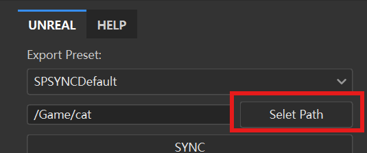 
You can right-click and navigate to the relevant directory in the resource manager page in UE. 
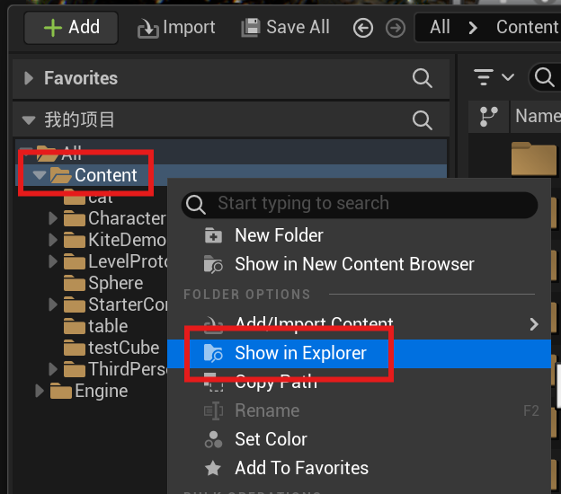 

d. By default, Auto Export Texture is checked. When this option is checked, the output command provided by SP is used. 
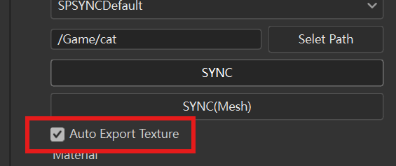 
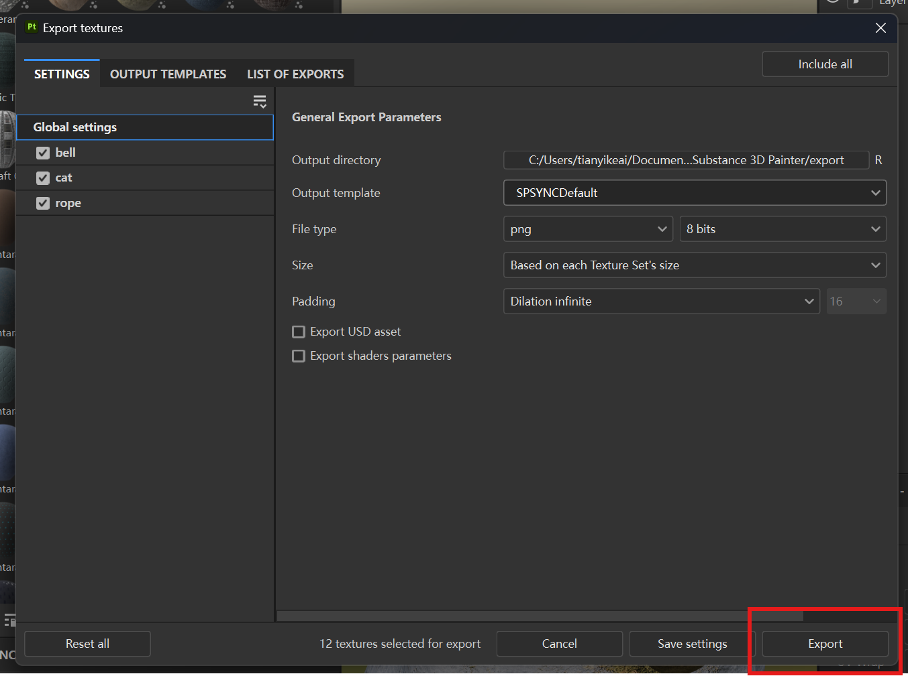 
In addition to exporting textures in the specified path, the related textures will also be automatically synchronized to the set engine directory. 

e. Under the material module, if Create Materials is checked, while synchronizing the texture, the material will be automatically created according to the settings, and the output texture will be linked to the material. If there is a material with the same name in the current output directory, it will not be created again and the settings will not be overwritten. In non-UDIM mode, only one parent material will be created, and the rest are material instances. In UDIM mode, they are all separate materials. The default blending type of the material is Opaque. If there is an Opacity channel in the Texture Set, the material blending mode is Masked. If there is a Translucency channel, the material blending mode is Translucent. The default Masked type material has the Dither jitter mode enabled. 
The naming method of materials in UE is:
M (Material)/MI (Material Instance) + _Model Name + _Material Name
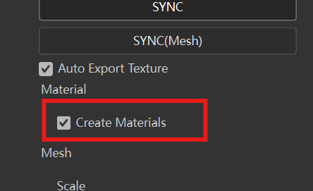 

f. Click the SYNC button to directly synchronize the texture to the corresponding directory of the engine. If there is an existing file with the same name, it will be overwritten. 
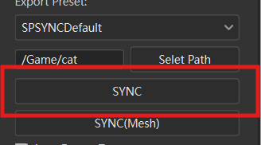 

g. Click SYNC(Mesh) to synchronize the model, material, and texture to the corresponding directory of the engine. At the same time, generate a model in front of the viewport in the engine, at a certain distance from the ground. The model import is set to the forward direction in the X direction, and the scaling value is the parameter in Scale. The default is 100. It can be adjusted according to actual conditions. 
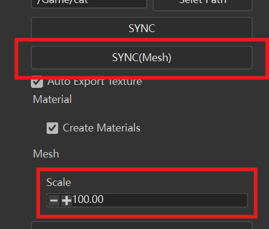 
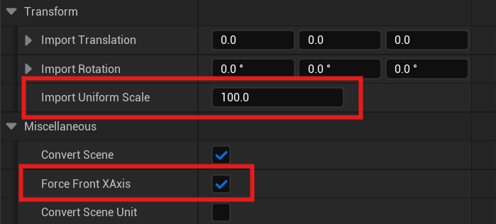 

h. Click View Sync to synchronize the current SP viewport with the viewport in UE. It is convenient to view the effect of the asset in the current engine environment. Click again to turn off synchronization. When synchronizing, UE will automatically enter the game View mode. You can switch it through the "g" shortcut key in the engine. 
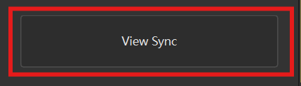 

## Contact
- Email    : yangskin@163.com
- BiliBili : https://space.bilibili.com/249466

