# Introduction

Substance 3D Painter synchronization UE plugin 

## Function Introduction
●Seamless Integration:
Through the plug-in, assets in Substance Painter can be synchronized to Unreal Engine with one click, reducing manual operations and intermediate steps.
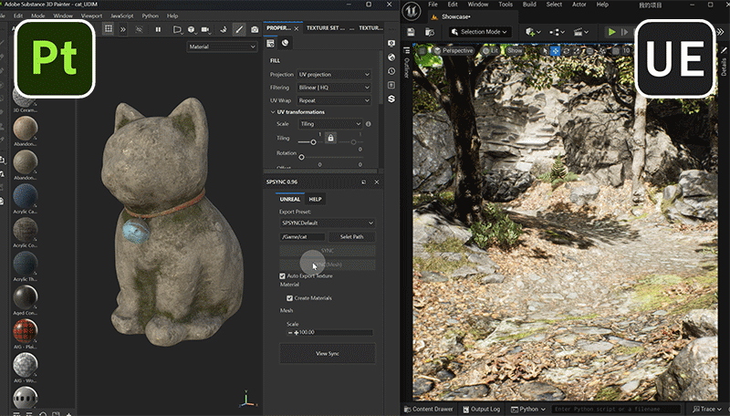

●Real-time Viewport Synchronization:
Real-time synchronization between Substance Painter and Unreal Engine viewports is achieved, and artists can directly view the effects in the engine, improving work efficiency.
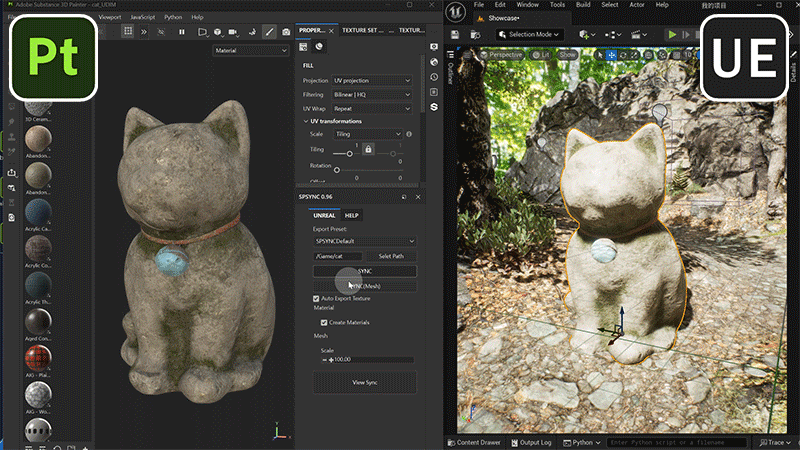

●Automation and Flexibility:
Supports automatic creation of materials and synchronization of maps, and provides flexible output path settings and material configuration options to meet the needs of different projects.
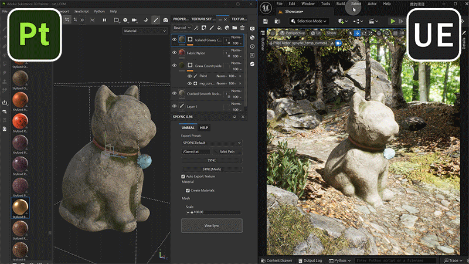

## Video Demonstration
 

## Features
- Output textures according to presets
- Save corresponding paths in the engine
- Automatically output models
- Automatically create materials
- Automatically assemble models
- One-click synchronization of textures
- Synchronize viewports
- UDIM support

## Installation
- UE menu 
  Edit>Editor Preferences>Use Less CPU when in Background > Uncheck
  Edit>Project Settings>Python Remote Execution>Enable Remote Execution > Check
  
  UDIM support
  Edit>Project Settings>Engine>Rendering>Enable virtual texture support Check
  Edit>Project Settings>Engine>Rendering>Enable virtual texture for Opacity Mask Check

- Copy it to this "C:\Users\username\Documents\Adobe\Adobe Substance 3D Painter\python\plugins" directory

#### Version requirements 
  Substanc 3d Painter 10.1 
  Unreal 5.4 (theoretically 5.x and above are all supported but not tested) 

#### UE settings 
a. Turn off the Use Less CPU when in Background option in Editor Preferences to prevent UE from freezing when synchronizing the viewport. 
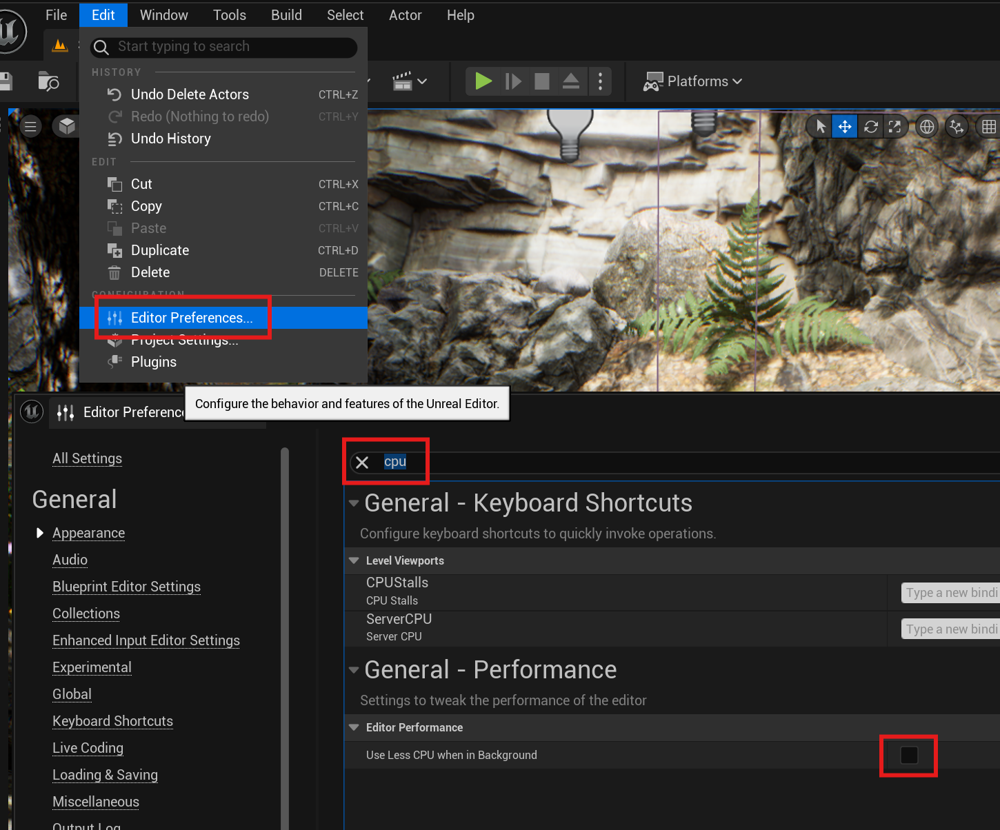 

b. Turn on Enable Remote Execution in Project Settings to support remote execution of Python scripts. 
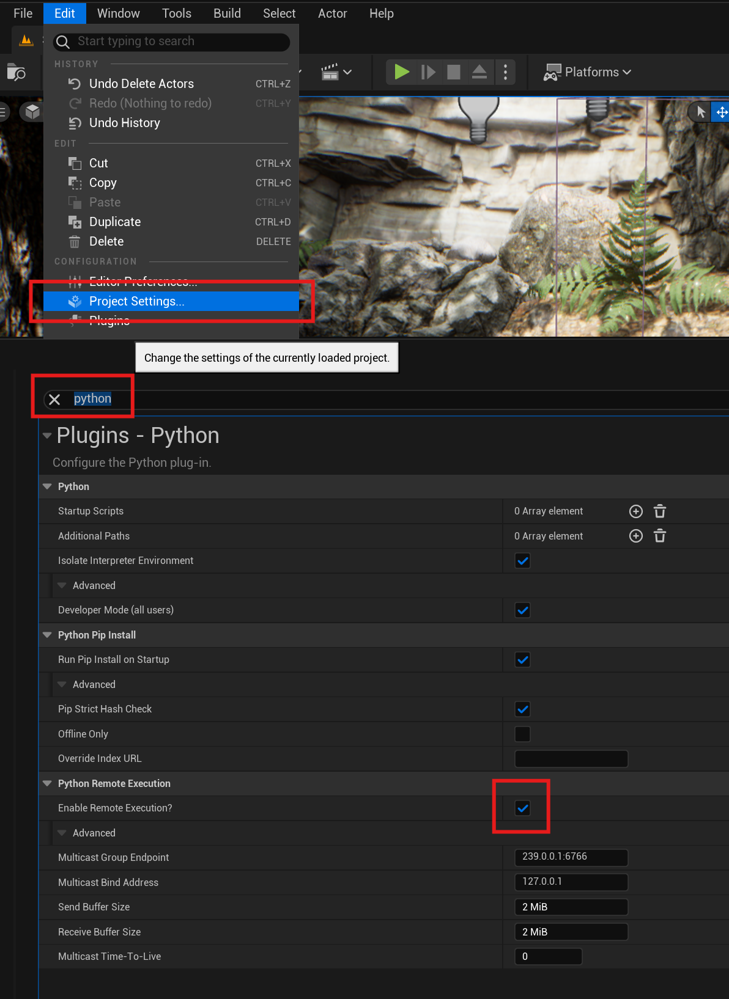 

c. If UDIM support is required, you need to turn on Enable virtual texture support and Enable virtual textures for Opacity Mask under Project Settings->Rendering to support virtual textures. 
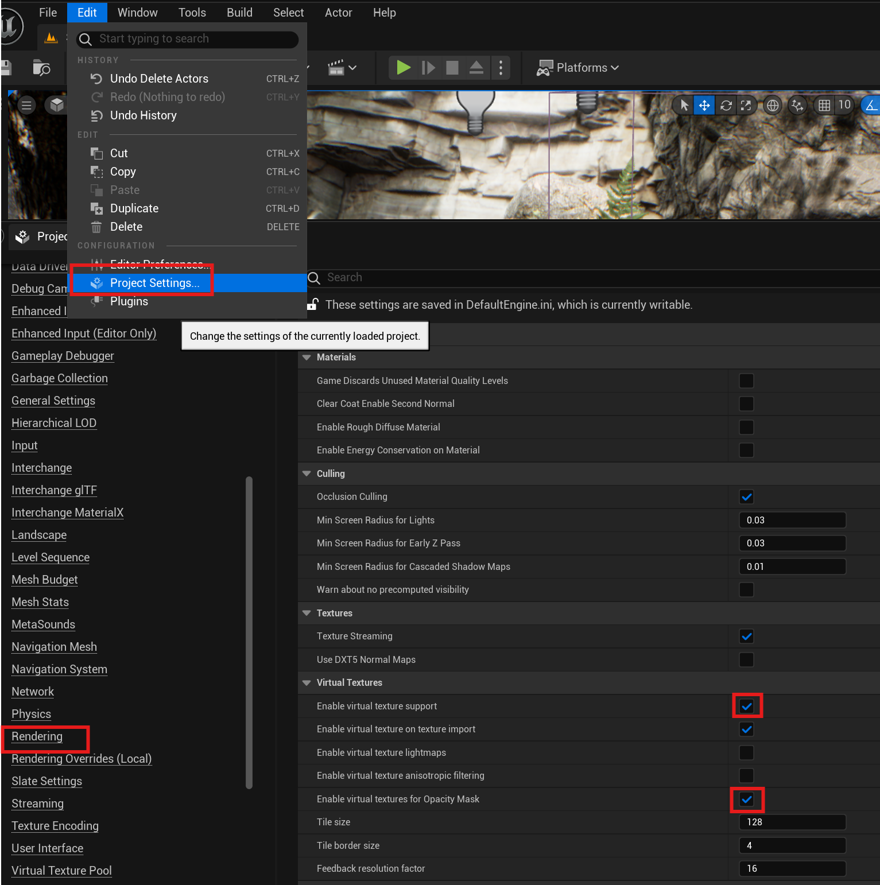 

### SP settings 
a. Python>Plugins Folder to open the python plugin directory. 
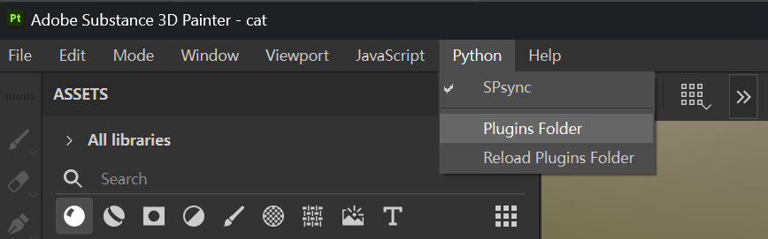 

b. Unzip to the Plugins directory and restart SP. 
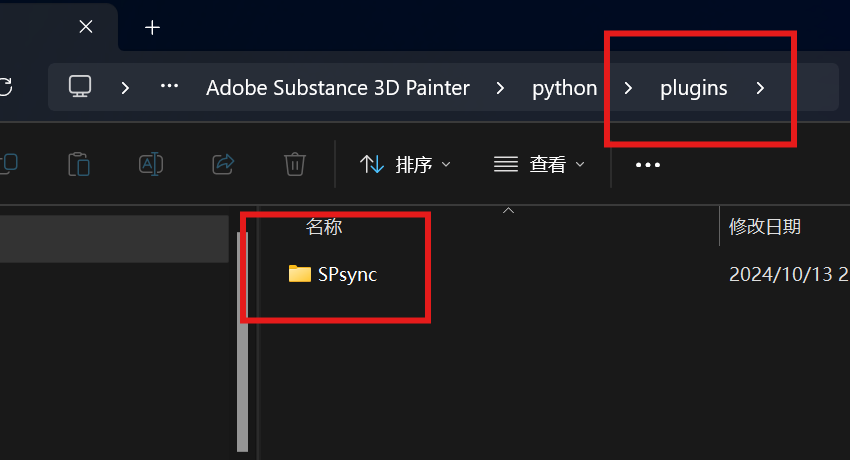 

c. Make sure SPsync is enabled. 
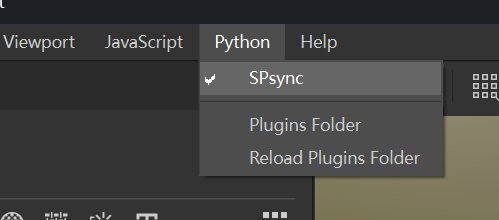 
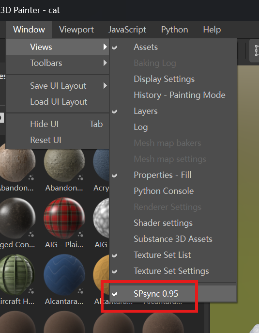 

d. Plugin window 
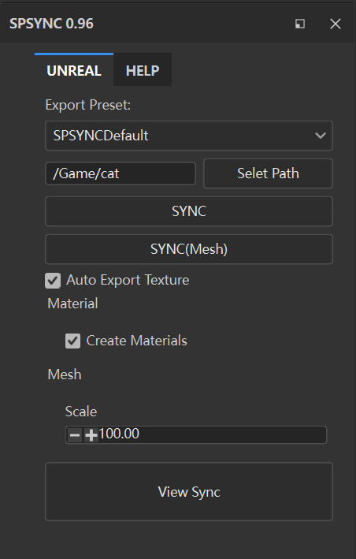 

## Contact
- Email    : yangskin@163.com
- BiliBili : https://space.bilibili.com/249466

