# SPsync — Substance 3D Painter ↔ Unreal Engine 双向同步插件

> 版本: 0.971 | 环境: Substance 3D Painter 10.1+ | 引擎: Unreal Engine 5.4+（开发基于 5.7）

SPsync 是 Adobe Substance 3D Painter 插件，实现与 Unreal Engine 的**双向同步**，包括纹理导出/回传、材质自动创建、网格导入、实时相机同步，以及与 UE 侧 AssetCustoms 插件的跨工具自动化协作。

> **注意**：SPsync（SP 侧）与 [AssetCustoms](https://github.com/xxx/AssetCustoms)（UE 侧）是**独立发布**的两个插件。SPsync 独立使用时可完成 SP→UE 单向同步；配合 AssetCustoms 使用时支持 UE→SP→UE 完整往返流程。

---

## 功能概览

### 基础功能（SPsync 独立使用）

| 功能 | 说明 |
|------|------|
| **纹理同步** | 按预设导出纹理到 UE 指定目录，自动同步 |
| **材质自动创建** | 支持 Opaque / Masked / Translucent + Emissive，UDIM 模式独立材质 |
| **网格导入** | SYNC(Mesh) 一键导入模型到 UE 场景并放置 |
| **实时相机同步** | SP→UE 视口同步（~30fps） |
| **配置持久化** | 导出路径/预设等配置保存在 SP 项目元数据中 |
| **UDIM 支持** | 完整的 UDIM 纹理同步与材质创建 |
| **Auto Export** | 勾选后 SP 导出自动触发 UE 同步 |
| **高模辅助 Bake** | 选择高模 FBX 后一键烘焙 Normal/AO/Curvature/Position/Thickness 等 Mesh Maps |

### 高级功能（配合 AssetCustoms 使用）

| 功能 | 说明 |
|------|------|
| **UE→SP 一键发送** | UE Content Browser 右键 SM → Send to SP → 自动创建项目 + 导入贴图 + 构建 Layer |
| **Config Profile 驱动映射** | 从 SM/MI 的 Metadata Tag 读取 Profile → 动态生成 SP 通道映射 |
| **Per-Material Profile** | 多材质槽 SM 每个 MI 独立 Profile，多 TextureSet 分发 |
| **Grayscale Conversion Filter** | Packed Texture (MRO) 在 SP 中自动拆分为独立通道 |
| **Round-Trip Sync** | SP 编辑后 SYNC 自动按 UE 原始格式导出 → 刷新 UE 原贴图（不创建新资产） |
| **贴图尺寸控制** | `max_resolution`（int POT）全管线统一：UE→SP 项目创建→SP 导出 |
| **分辨率权威分离** | `texture_size` 来源于导出文件实际尺寸，SP 端 Clamp [128, 4096] |

---

## Function Introduction
●Seamless Integration:
Through the plug-in, assets in Substance Painter can be synchronized to Unreal Engine with one click, reducing manual operations and intermediate steps.
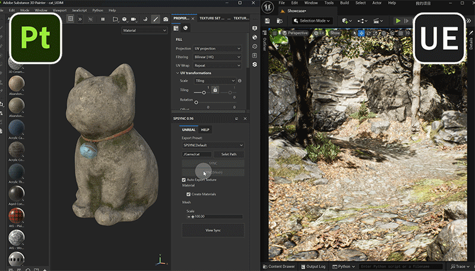

●Real-time Viewport Synchronization:
Real-time synchronization between Substance Painter and Unreal Engine viewports is achieved, and artists can directly view the effects in the engine, improving work efficiency.
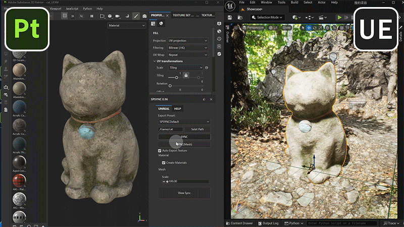

●Automation and Flexibility:
Supports automatic creation of materials and synchronization of maps, and provides flexible output path settings and material configuration options to meet the needs of different projects.
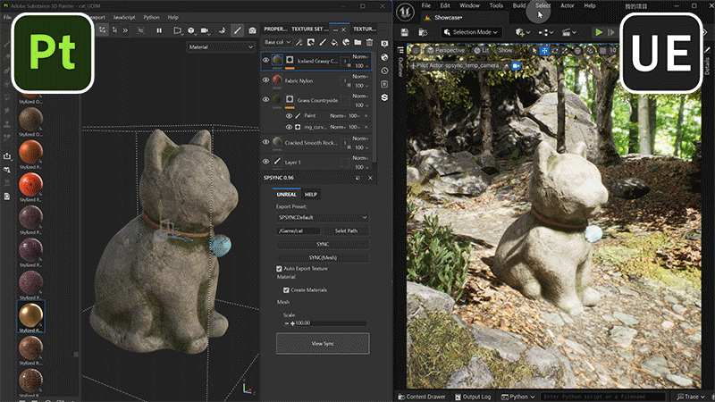

## Video Demonstration
[](https://www.youtube.com/watch?v=K-tsUKiZ9qc)<br>

## Features
- Output textures according to presets
- Save corresponding paths in the engine
- Automatically output models
- Automatically create materials
- Automatically assemble models
- One-click synchronization of textures
- Synchronize viewports
- UDIM support
- **UE→SP one-click send** (via AssetCustoms): auto-create project, import textures, build layers
- **Config Profile driven mapping**: read SM/MI metadata → dynamic channel mapping
- **Grayscale Conversion Filter**: auto-split packed textures (MRO) in SP
- **Round-Trip Sync**: auto-detect UE metadata → export in original format → refresh UE textures
- **High Poly Bake**: select high-poly FBX → auto-bake Normal/AO/Curvature/Position/Thickness mesh maps
- **Texture Size Control**: max_resolution (int POT) pipeline-wide control
- **Resolution Authority Separation**: texture_size from actual export file dimensions, SP clamp [128, 4096]

## Installation
- UE menu 
  Edit>Editor Preferences>Use Less CPU when in Background > Uncheck
  Edit>Project Settings>Python Remote Execution>Enable Remote Execution > Check
  
  UDIM support
  Edit>Project Settings>Engine>Rendering>Enable virtual texture support Check
  Edit>Project Settings>Engine>Rendering>Enable virtual texture for Opacity Mask Check

- Copy it to this "C:\Users\username\Documents\Adobe\Adobe Substance 3D Painter\python\plugins" directory

#### Version requirements</br>
  Substance 3D Painter 10.1</br>
  Unreal 5.4+ (developed on 5.7)</br>
  For UE→SP features: AssetCustoms plugin installed in UE project</br>

#### UE settings</br>
a. Turn off the Use Less CPU when in Background option in Editor Preferences to prevent UE from freezing when synchronizing the viewport.</br>

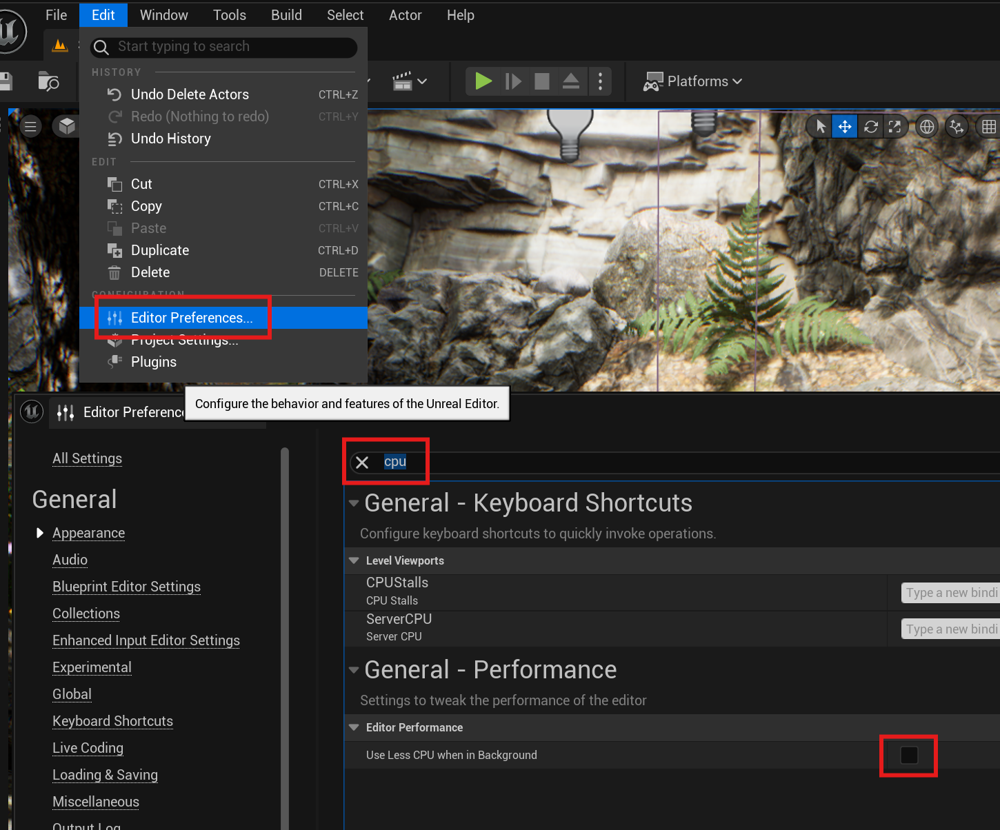</br>


b. Turn on Enable Remote Execution in Project Settings to support remote execution of Python scripts.</br>

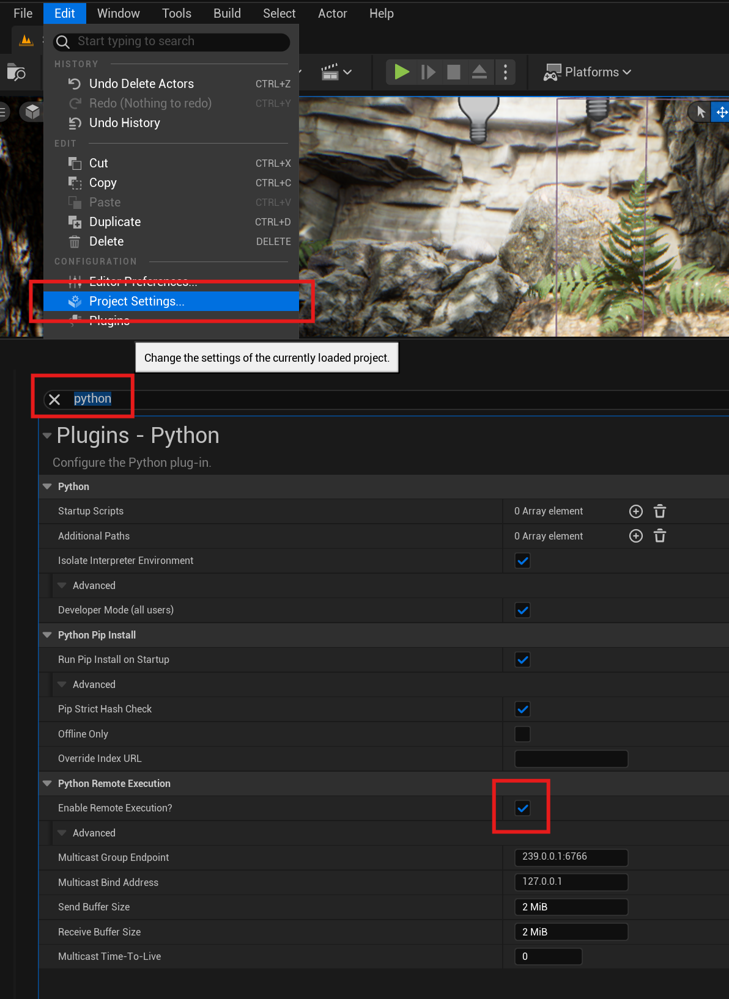</br>

c. If UDIM support is required, you need to turn on Enable virtual texture support and Enable virtual textures for Opacity Mask under Project Settings->Rendering to support virtual textures.</br>

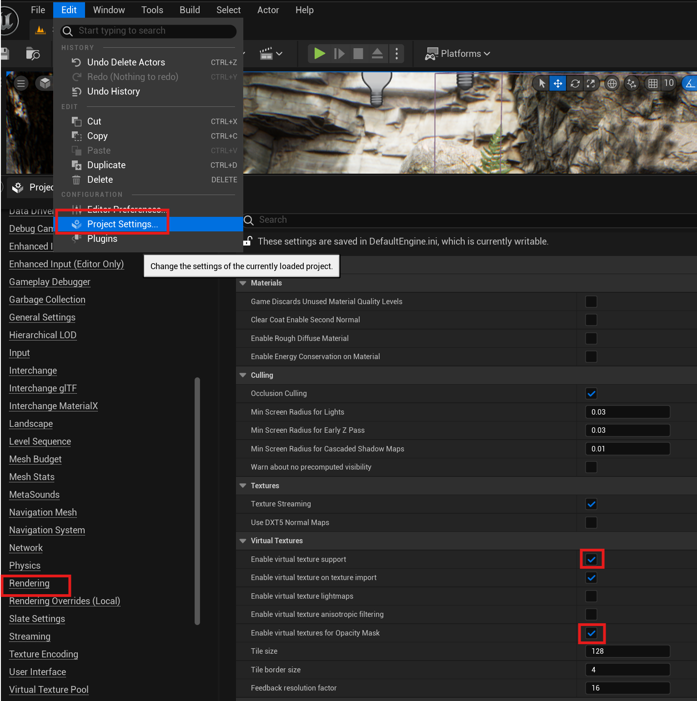</br>

### SP settings</br>
a. Python>Plugins Folder to open the python plugin directory.</br>

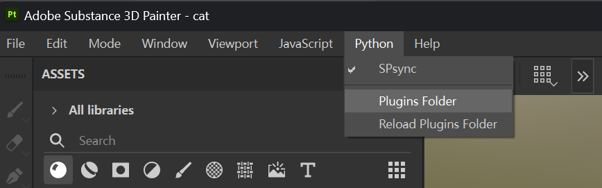</br>

b. Unzip to the Plugins directory and restart SP.</br>

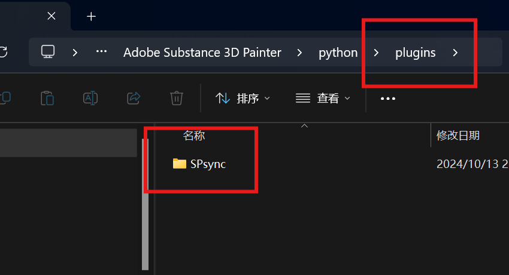</br>

c. Make sure SPsync is enabled.</br>

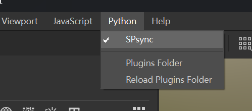</br>
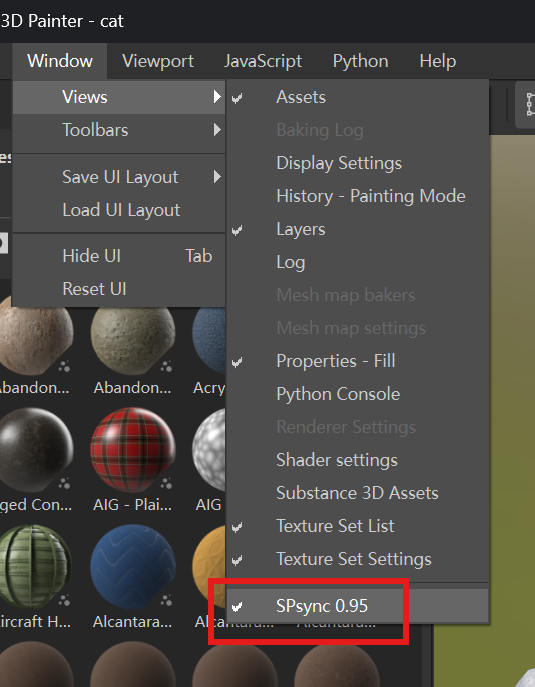</br>

d. Plugin window</br>

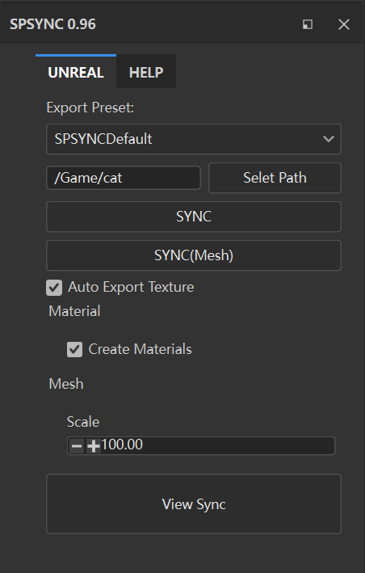</br>

#### How to use
a. You need to open the project and wait for the relevant assets to be loaded. Otherwise, the UI is frozen.</br>
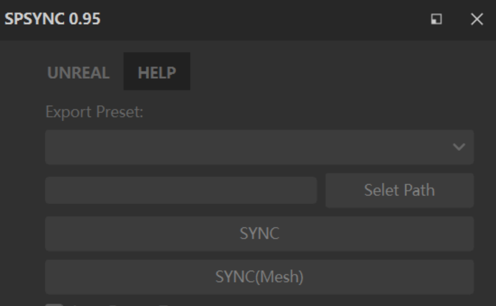</br>
b. In addition to the built-in or created output presets, the first preset is the preset that adapts to the automatically assembled material.
If you select other presets, the material and mounting model will not be automatically created.
By default, one material corresponds to four map channels.</br>
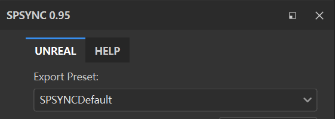</br>
| Suffix | R | G | B | A |
| :--: | :--: | :--: | :--: | :--: |
| _BCO | Alobedo.R | Alobedo.G | Alobedo.B | Opacity |
| _MRAS | Metallic | Roughness | AO | Translucency |
| _N | Normal.R | Normal.G | Normal.B | Null |
| _ES | Emissive.R | Emissive.G | Emissive.B | Null |

The output map is named:
T + _model name + _material name + _suffix name

c. Click Selet Path to set the path under the Content directory in the UE project.</br>
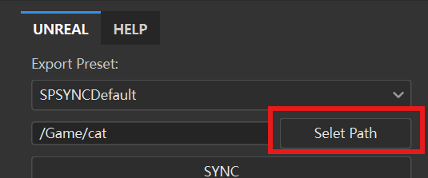</br>
You can right-click and navigate to the relevant directory in the resource manager page in UE.</br>
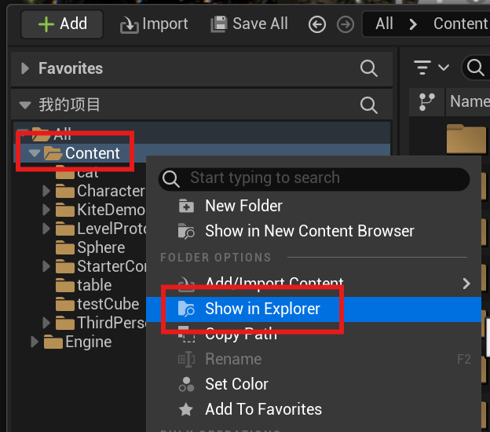</br>

d. By default, Auto Export Texture is checked. When this option is checked, the output command provided by SP is used.</br>
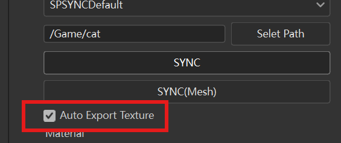</br>
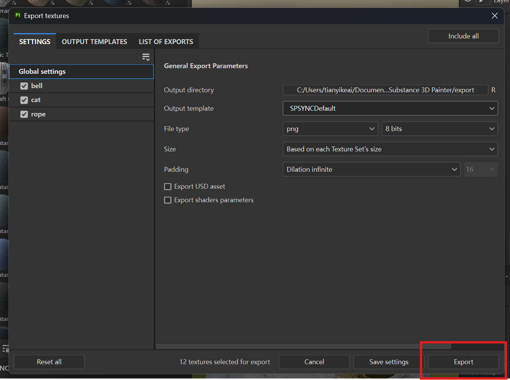</br>
In addition to exporting textures in the specified path, the related textures will also be automatically synchronized to the set engine directory.</br>

e. Under the material module, if Create Materials is checked, while synchronizing the texture, the material will be automatically created according to the settings, and the output texture will be linked to the material. If there is a material with the same name in the current output directory, it will not be created again and the settings will not be overwritten. In non-UDIM mode, only one parent material will be created, and the rest are material instances. In UDIM mode, they are all separate materials. The default blending type of the material is Opaque. If there is an Opacity channel in the Texture Set, the material blending mode is Masked. If there is a Translucency channel, the material blending mode is Translucent. The default Masked type material has the Dither jitter mode enabled.</br>
The naming method of materials in UE is:
M (Material)/MI (Material Instance) + _Model Name + _Material Name
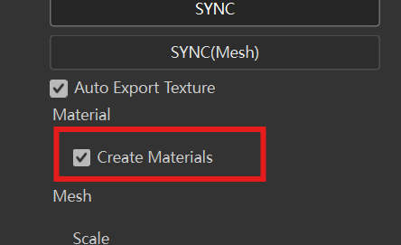</br>

f. Click the SYNC button to directly synchronize the texture to the corresponding directory of the engine. If there is an existing file with the same name, it will be overwritten.</br>
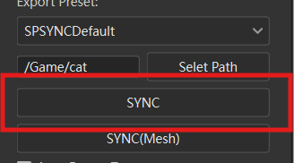</br>

g. Click SYNC(Mesh) to synchronize the model, material, and texture to the corresponding directory of the engine. At the same time, generate a model in front of the viewport in the engine, at a certain distance from the ground. The model import is set to the forward direction in the X direction, and the scaling value is the parameter in Scale. The default is 100. It can be adjusted according to actual conditions.</br>
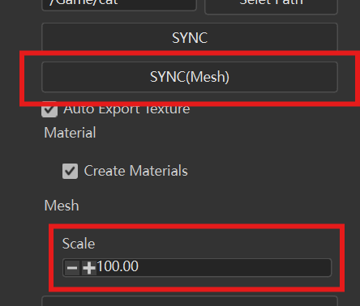</br>
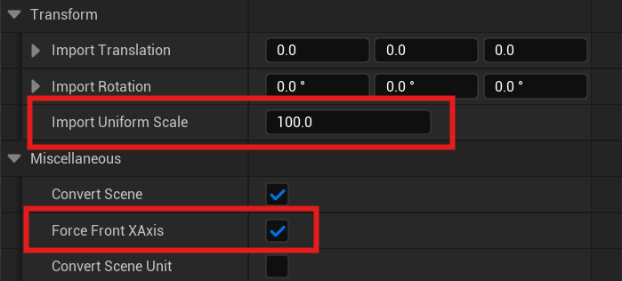</br>

h. Click View Sync to synchronize the current SP viewport with the viewport in UE. It is convenient to view the effect of the asset in the current engine environment. Click again to turn off synchronization. When synchronizing, UE will automatically enter the game View mode. You can switch it through the "g" shortcut key in the engine.</br>
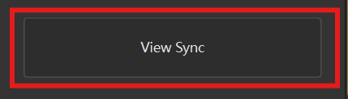</br>

## Architecture (Cross-Project Collaboration)

SPsync works with the UE-side **AssetCustoms** plugin for UE→SP→UE round-trip workflows. The two plugins are **published independently**.

```
AssetCustoms (UE)                              SPsync (SP)
─────────────                                  ──────────
sp_bridge.py                                   sp_receive.py
├── collect_material_info() → JSON             ├── receive_from_ue(json)
├── export_mesh_fbx()                          │   ├── project.create(mesh)
├── export_textures()                          │   ├── import textures + build layers
├── update_texture_sizes_from_exports()        │   ├── Grayscale Conversion Filter
└── send_to_sp() ──HTTP POST──────────────────►│   └── set_resolution (clamp [128,4096])
                                               │
sp_remote.py (HTTP → :60041)                   sp_channel_map.py
                                               ├── map UE→SP channel bindings
                                               ├── sizeLog2 export control
                                               └── roundtrip export config
                                               │
                                               sp_sync_export.py
                                               └── SYNC → roundtrip mode → refresh UE
```

### Communication
- **UE→SP**: HTTP POST base64(python_script) → SP Remote Scripting API (localhost:60041)
- **SP→UE**: Remote Execution TCP protocol (localhost:6776)

### Key Files

| File | Environment | Description |
|------|-------------|-------------|
| `sp_receive.py` | SP | Receives UE data, creates projects, builds layers, stores roundtrip metadata |
| `sp_channel_map.py` | SP | UE↔SP channel mapping, sizeLog2 computation, roundtrip export config |
| `sp_sync_export.py` | SP | Export orchestration, roundtrip mode auto-detection |
| `sp_sync_ue.py` | SP→UE | Bootstrap + JSON-parameterized UE script execution |
| `sp_bake.py` | SP | High-poly mesh baking manager (auto Normal/AO/Curvature/Position/Thickness) |
| `import_textures_ue.py` | UE remote | Texture import + refresh_textures() for roundtrip |
| `utils.py` | SP | Pure utility functions (11 functions, 37 tests) |

### Tests
- **191 pytest tests passed** (2026-03-26)
- Coverage: channel mapping, roundtrip export config, metadata, grayscale filter, texture size control, resolution clamp

---

## Contact
- Email    : yangskin@163.com
- BiliBili : https://space.bilibili.com/249466


